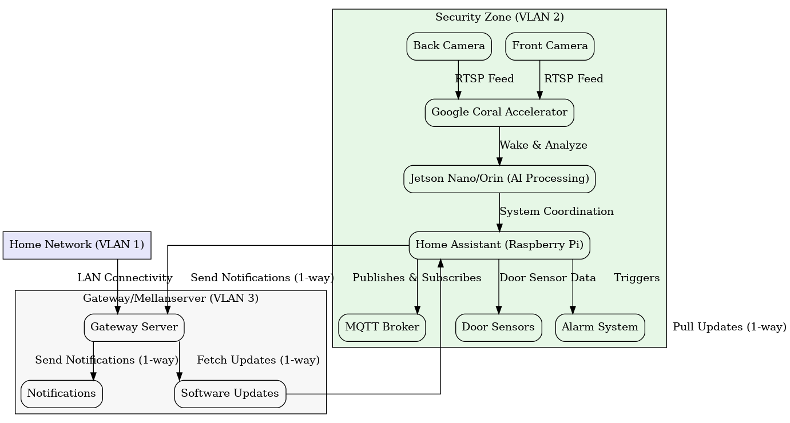

# AISec
Welcome to the repository for **AISec(temp name)**, an innovative and energy-efficient home security system powered by cutting-edge AI technologies. This project combines advanced machine learning models, edge computing, and local data processing to create a smart, private, and highly effective security solution.

A simplied version of the network architecture can be found here:

---

## Key Features

### 1. **Advanced Network Segmentation**
- **Three Isolated VLANs:**
  - **VLAN 1:** Home network for general devices (computers, phones, smart devices).
  - **VLAN 2 (Security Zone):** Fully offline, hosting cameras, AI models, and processing units.
  - **VLAN 3 (Gateway):** A physically separated Raspberry Pi handling external communication, including notifications and software updates, with strict firewall rules and 2FA-protected VPN access.
- **Security First:** Communication between VLANs is strictly controlled and time-limited, ensuring maximum protection against intrusions.

### 2. **AI-Driven Insights**
- **Real-Time Analysis:** Models detect, classify, and track objects, distinguishing between humans, animals, and vehicles.
- **Facial Recognition:** Limited to close-range interactions, ensuring privacy while providing convenience for family members.
- **Geofencing Integration:** System behavior adapts dynamically based on location data, reducing false alarms.

### 3. **Energy Efficiency**
- **Optimized Edge AI:** Combining pruning, quantization, and sparsity techniques to minimize resource usage.
- **Smart Workflows:** A Coral accelerator handles initial detections, waking the Jetson Orin only when necessary for deeper analysis.
- **Local Data Storage:** All data processing and storage occur locally, significantly reducing energy and environmental impact.

### 4. **Privacy by Design**
- **GDPR Compliance:** Data is anonymized before being used for model training, ensuring ethical AI practices.
- **Incident Data:** Critical incidents (e.g., intrusion attempts) are securely stored on a local NAS for future reference.

---

## Roadmap

### Phase 1: System Development
- [x] Design advanced network segmentation.
- [x] Develop AI models for object detection, classification, and facial recognition.
- [Currently] Optimize models using pruning, quantization, and sparsity.

### Phase 2: Integration
- [ ] Implement geofencing and AI-driven motion detection.
- [ ] Set up energy-efficient workflows between Coral and Jetson Orin.
- [ ] Configure local NAS for secure incident data storage.

### Phase 3: User Experience
- [ ] Develop a sleek user interface for system control and monitoring.
- [ ] Implement customizable notification options (SMS, email, push).
- [ ] Conduct thorough testing to ensure robustness.

### Phase 4: Open Source Contributions
- [ ] Share non-sensitive parts of the system to inspire and collaborate with the open-source community.
- [ ] Publish insights on edge AI optimization for energy efficiency.

---

## Contributing

Contributions are welcome! If you have suggestions or improvements, please submit a pull request or open an issue. Note that sensitive system components and proprietary configurations will not be shared to maintain security and integrity.

---

## License

This project is licensed under the MIT License. See the [LICENSE](LICENSE) file for details.

---

## Acknowledgments

Special thanks to the open-source community for providing tools, frameworks, and inspiration for this project.

---

## Connect

Follow the journey and stay updated:
- [LinkedIn]([https://www.linkedin.com/in/johnny-johansson-vbg/])
- [GitHub](https://github.com/TheAICrafter)

Let’s revolutionize home security together!

